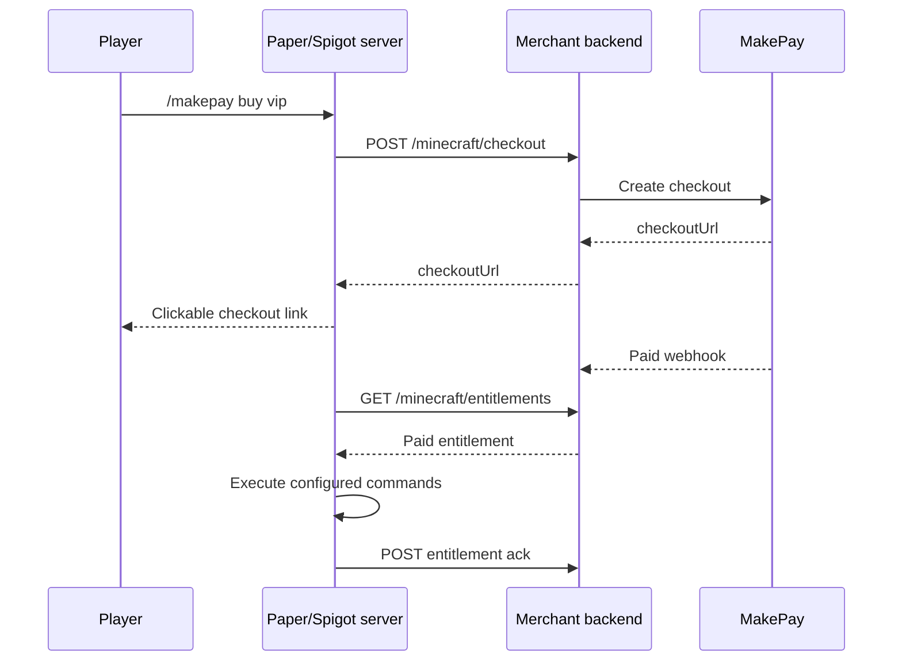

# MakePay Minecraft

Paper/Spigot plugin for MakePay-powered server monetization: ranks, credits, donations, and other server-side digital goods.

The plugin is intentionally relay-based. Minecraft servers call your own backend to create checkout links and poll verified entitlements. Your backend talks to MakePay, verifies webhooks, and decides what should be granted.

## Features

- `/makepay buy <package>` creates a player-specific checkout link.
- `/makepay packages` lists configured packages.
- Background entitlement polling grants paid purchases idempotently.
- Configurable console commands for ranks, currency, crates, items, or announcements.
- Optional relay token header for authenticating the Minecraft server to your backend.
- No MakePay credentials in the plugin or server config.

## Build

```bash
gradle build
```

The shaded plugin JAR is written to `build/libs/makepay-minecraft-0.1.0.jar`.

## Install

1. Copy the JAR into your server `plugins/` directory.
2. Start the server once to generate `plugins/MakePay/config.yml`.
3. Configure your backend relay URL, server ID, optional relay token, and packages.
4. Restart or run `/makepay reload`.

## Example Package

```yaml
packages:
  vip:
    display-name: "VIP Rank"
    amount-minor: 999
    currency: "USD"
    description: "VIP rank for this server"
    commands:
      - "lp user {player} parent add vip"
      - "say {player} bought VIP with MakePay"
```

Supported command placeholders:

- `{player}`
- `{uuid}`
- `{package}`
- `{external_id}`
- `{entitlement_id}`

## Backend Flow



## Security

- Do not put MakePay API credentials on Minecraft servers.
- Treat the Minecraft plugin as a fulfillment worker, not a payment verifier.
- Grant entitlements only from backend records that were created after webhook verification.
- Keep configured console commands narrow and reviewed.
- Use the optional relay token only for authenticating your server to your backend.

## Documentation

- [Backend contract](docs/BACKEND_CONTRACT.md)
- [Roadmap](docs/ROADMAP.md)
- [Repository protection](docs/REPOSITORY_PROTECTION.md)
